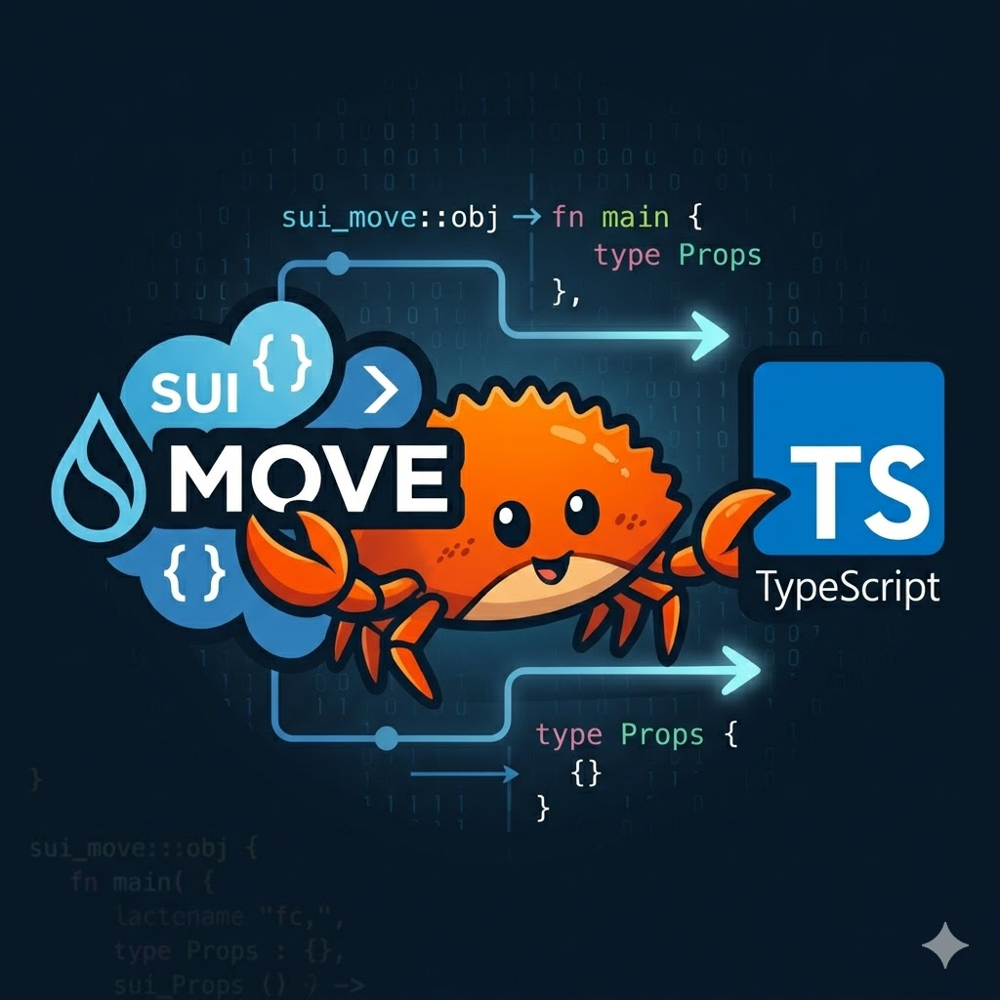

<p align="center">
  
</p>

# move2ts

Generate type-safe TypeScript wrappers for Sui Move smart contracts.

## Features

- Parses Sui Move source files (`.move`) using the official `move-compiler` parser crate
- Generates TypeScript functions that call Move entry/public methods via the `@mysten/sui` SDK
- Type-safe: maps Move types to TypeScript types (`u64` to `bigint`, `vector<u8>` to `Uint8Array`, etc.)
- Detects singleton objects (created only in `init()`) and backs them with environment variables
- Auto-strips `TxContext`, auto-injects `Clock` and `Random` parameters
- All generated functions return `TransactionResult` for composability in Programmable Transaction Blocks
- Uses the SDK's `TransactionObjectInput` for all object parameters
- Supports generic type parameters
- CLI filtering: `--methods`, `--skip-methods`
- Portable generated code: works with Node.js, Deno, Bun

## Installation

### Via Homebrew (macOS / Linux)

```
brew install avbel/tap/move2ts
```

### Via npm

```
npm install -g @avbel/move2ts
# or
pnpm add -g @avbel/move2ts
# or
npx @avbel/move2ts <input>
```

### Download from GitHub Releases

Download the binary for your platform from the [Releases page](https://github.com/avbel/move2ts/releases).

Available platforms: Linux x64/arm64, macOS arm64, Windows x64.

### Build from source

```
git clone https://github.com/avbel/move2ts.git
cd move2ts
cargo build --release
# Binary at target/release/move2ts
```

## Usage

### Basic usage

```bash
# Single file
move2ts path/to/module.move

# Package directory (with Move.toml)
move2ts path/to/package/

# Custom output directory
move2ts path/to/package/ -o ./src/generated
```

### CLI Options

```
move2ts <input> [options]

Arguments:
  <input>                          .move file or package directory

Options:
  -o, --output <dir>               Output directory (default: ./generated)
  --methods <method1,method2>      Generate only these methods
  --skip-methods <m1,m2>           Skip these methods
  --singletons <Struct1,Struct2>   Manual singleton overrides (struct names)
  --package-id-name <ENV_VAR>      Override package ID env var name
  --events                         Include event type definitions in output
```

### Environment Variables

Generated code reads these environment variables at runtime:

- `{PROJECT}_PACKAGE_ID` -- The on-chain package address (required). Derived from the Move.toml project name in package mode, or from the module name in single-file mode. Override with `--package-id-name`.
- `{PROJECT}_{STRUCT}_ID` -- Singleton object IDs (optional). When a singleton parameter is not explicitly passed, the generated code falls back to the corresponding env var.

## Type Mapping

| Move Type | TypeScript Type | SDK Encoding |
|---|---|---|
| `u8` | `number` | `tx.pure.u8(v)` |
| `u16` | `number` | `tx.pure.u16(v)` |
| `u32` | `number` | `tx.pure.u32(v)` |
| `u64` | `bigint` | `tx.pure.u64(v)` |
| `u128` | `bigint` | `tx.pure.u128(v)` |
| `u256` | `bigint` | `tx.pure.u256(v)` |
| `bool` | `boolean` | `tx.pure.bool(v)` |
| `address` | `string` | `tx.pure.address(v)` |
| `0x1::string::String` | `string` | `tx.pure.string(v)` |
| `0x2::object::ID` | `string` | `tx.pure.id(v)` |
| `vector<u8>` | `Uint8Array` | `tx.pure('vector<u8>', v)` |
| `vector<T>` | `MappedT[]` | `tx.pure.vector('innerType', v)` |
| `Option<T>` | `MappedT \| null` | `tx.pure.option('innerType', v)` |
| `struct (copy+drop)` | `{ field1: type1, ... }` | `tx.pure(bcs.struct(...).serialize(v))` |
| `Coin<T>` / `Balance<T>` (by ref) | `TransactionObjectInput` | `tx.object(v)` |
| `&T` / `&mut T` (object) | `TransactionObjectInput` | `tx.object(v)` |

`Option<T>` maps to `T | null` (not `T | undefined`) because the SDK's `tx.pure.option()` uses `null` for absent values.

## Generated Code Example

Given a Move module with a marketplace, move2ts produces TypeScript like this:

```typescript
import process from 'node:process';
import type { TransactionObjectInput, TransactionResult } from '@mysten/sui/transactions';
import { Transaction } from '@mysten/sui/transactions';
import { isValidSuiAddress } from '@mysten/sui/utils';
import { InvalidConfigError } from './move2ts-errors';

// Entry function -- singleton resolved lazily
export function listItem(
  tx: Transaction,
  args: {
    price: bigint;
    marketplaceId?: TransactionObjectInput;
  },
): TransactionResult {
  return tx.moveCall({
    target: `${getPackageId()}::marketplace::list_item`,
    arguments: [
      tx.object(args.marketplaceId ?? getMarketplaceId()),
      tx.pure.u64(args.price),
    ],
  });
}

// Public function with generics
export function withdraw(
  tx: Transaction,
  args: {
    typeT: string;
    poolId: TransactionObjectInput;
    amount: bigint;
  },
): TransactionResult {
  return tx.moveCall({
    target: `${getPackageId()}::marketplace::withdraw`,
    typeArguments: [args.typeT],
    arguments: [
      tx.object(args.poolId),
      tx.pure.u64(args.amount),
    ],
  });
}

// Function with Clock -- auto-injected
export function getTimedPrice(
  tx: Transaction,
  args: {
    marketplaceId?: TransactionObjectInput;
  },
): TransactionResult {
  return tx.moveCall({
    target: `${getPackageId()}::marketplace::get_timed_price`,
    arguments: [
      tx.object(args.marketplaceId ?? getMarketplaceId()),
      tx.object.clock(),
    ],
  });
}

// --- Internal helpers (not exported) ---

function getPackageId(): string {
  const id = process.env.MY_PROJECT_PACKAGE_ID;
  if (!id) {
    throw new InvalidConfigError('MY_PROJECT_PACKAGE_ID environment variable is not set');
  }
  if (!isValidSuiAddress(id)) {
    throw new InvalidConfigError(`MY_PROJECT_PACKAGE_ID is not a valid Sui address: ${id}`);
  }
  return id;
}

function getMarketplaceId(): string {
  const id = process.env.MY_PROJECT_MARKETPLACE_ID;
  if (!id) {
    throw new InvalidConfigError('MY_PROJECT_MARKETPLACE_ID environment variable is not set');
  }
  if (!isValidSuiAddress(id)) {
    throw new InvalidConfigError(`MY_PROJECT_MARKETPLACE_ID is not a valid Sui address: ${id}`);
  }
  return id;
}
```

Key points in the generated code:

- **Lazy validation.** Package ID and singleton object IDs are read from env vars at call time, not at import time. This prevents import-time crashes in tests and preserves tree-shaking.
- **Singleton parameters are optional.** If a struct is only ever constructed inside `init()`, the corresponding parameter becomes optional with a `?` suffix. When omitted, the generated code falls back to the env var.
- **Clock and Random are auto-injected.** Move functions that accept `&Clock` or `&Random` have those parameters stripped from the TypeScript signature; the generated code passes `tx.object.clock()` or `tx.object.random()` automatically.
- **All functions return `TransactionResult`.** This enables composability -- callers can destructure results and pass them to subsequent transaction commands.

When a function parameter is a pure value struct (has `copy` and `drop` abilities but no `key`), the generated code imports `bcs` from `@mysten/bcs` and serializes the struct using BCS encoding instead of `tx.object()`.

A shared `move2ts-errors.ts` file is also generated with the `InvalidConfigError` class. Address validation uses `isValidSuiAddress` from `@mysten/sui/utils`.

### Event Types (`--events`)

When `--events` is passed, the tool detects structs emitted via `event::emit()` and generates `export type` declarations with all fields as `readonly string`:

```typescript
// --- Event Types ---

export type ItemPurchased = {
  readonly buyer: string;
  readonly seller: string;
  readonly price: string;
  readonly item_id: string;
};
```

Event detection works by scanning function bodies for `event::emit()` calls. Only actually emitted structs are included — copy+drop structs that are never emitted are excluded.

If a struct is both emitted AND used as a function parameter, two types are generated: a BCS `interface` (for the param) and a `type` with an `Event` suffix (for event consumption).

## Usage Scenarios

### Generating SDK for a DeFi protocol

```bash
# Generate wrappers for your entire DeFi package
move2ts ./contracts/my-dex/ -o ./sdk/src/generated

# Set env vars and use in your app
export MY_DEX_PACKAGE_ID=0xabc123...
export MY_DEX_POOL_ID=0xdef456...
```

```typescript
import { Transaction } from '@mysten/sui/transactions';
import { swap } from './generated/pool';

const tx = new Transaction();
swap(tx, {
  typeX: '0x2::sui::SUI',
  typeY: '0xdead::usdc::USDC',
  poolId: '0xdef456...',
  amountIn: 1000000n,
  minOut: 990000n,
});
```

### Generating only specific functions

```bash
# Generate wrappers for listing operations only
move2ts ./marketplace.move --methods list_item,cancel_listing -o ./sdk

# Skip admin-only functions
move2ts ./marketplace.move --skip-methods admin_withdraw,set_fee -o ./sdk
```

```

### Composing multiple transaction commands

```typescript
import { Transaction } from '@mysten/sui/transactions';
import { listItem } from './generated/marketplace';
import { mintNft } from './generated/nft';

const tx = new Transaction();

// Mint an NFT, then list it — results are composable
const [nft] = mintNft(tx, { name: 'Cool NFT' });
listItem(tx, { item: nft, price: 1000000n });

// Sign and execute
await client.signAndExecuteTransaction({ transaction: tx, signer: keypair });
```

### Manual singleton overrides

```bash
# When the automatic singleton detection doesn't work (e.g., helper function creates the object)
move2ts ./contracts/ --singletons Registry,Config
```

## How It Works

move2ts uses the `move-compiler` parser crate from the [MystenLabs/sui](https://github.com/MystenLabs/sui) repository (via git dependency) to parse Move source files into an AST. It then:

1. **Parses** `.move` files using `parse_file_string` from the Move compiler, reusing a single `CompilationEnv` across all files for efficiency.
2. **Analyzes** the AST to extract function signatures (`entry` and `public`), struct definitions, and type information. Singleton detection identifies structs that are only constructed inside `init()`.
3. **Generates** TypeScript using the `@mysten/sui` SDK types. Each Move module becomes a `.ts` file with typed wrapper functions that construct `moveCall` invocations with correctly encoded arguments.

The tool operates at the parser level only -- it does not compile or verify Move bytecode.

## License

[MIT](LICENSE)
